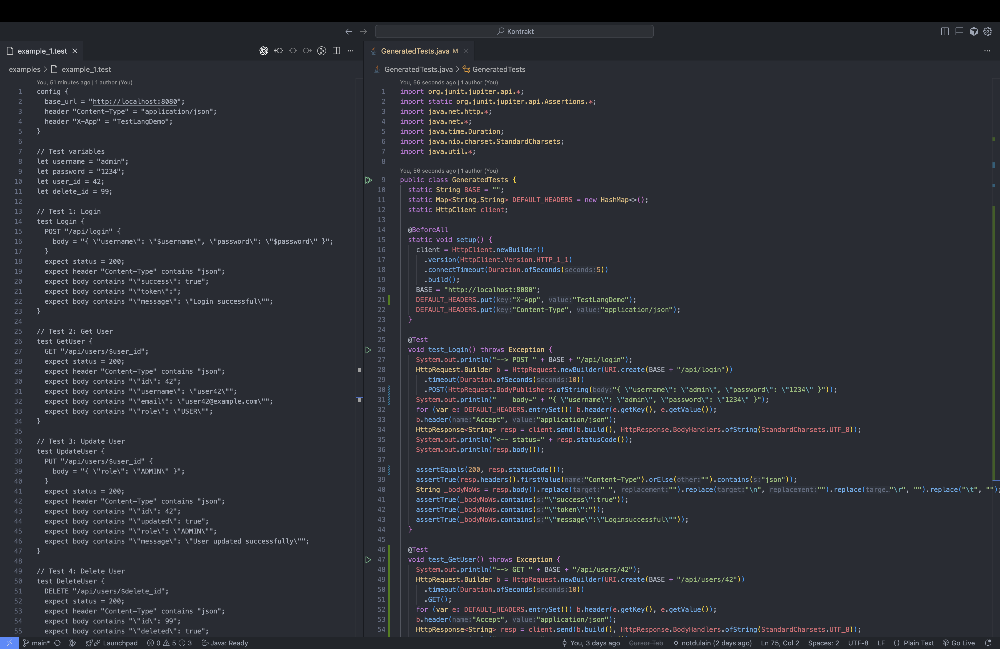
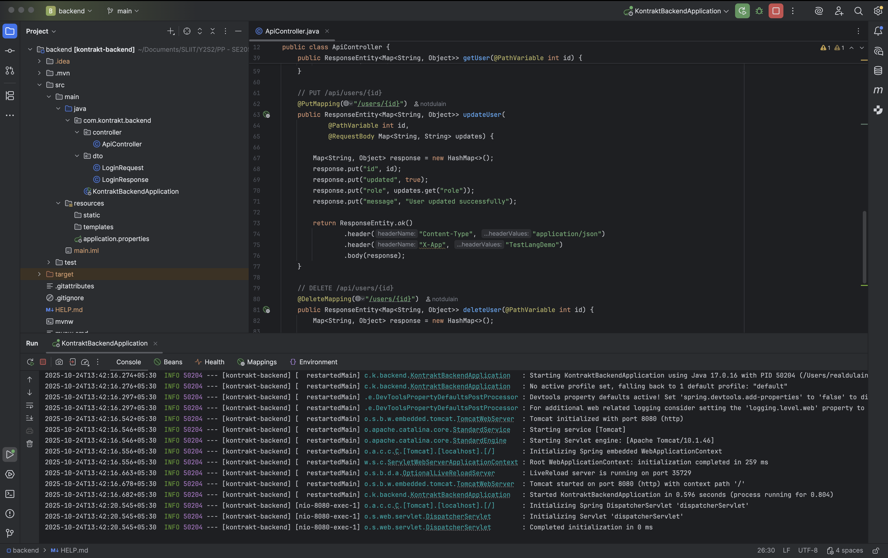
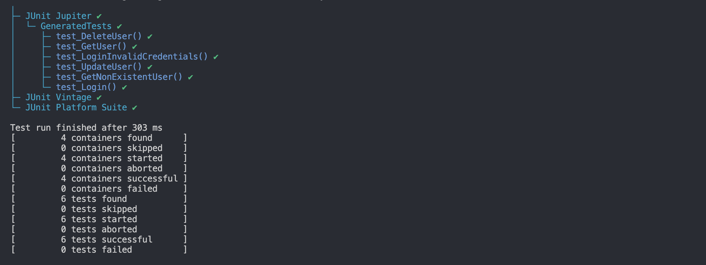
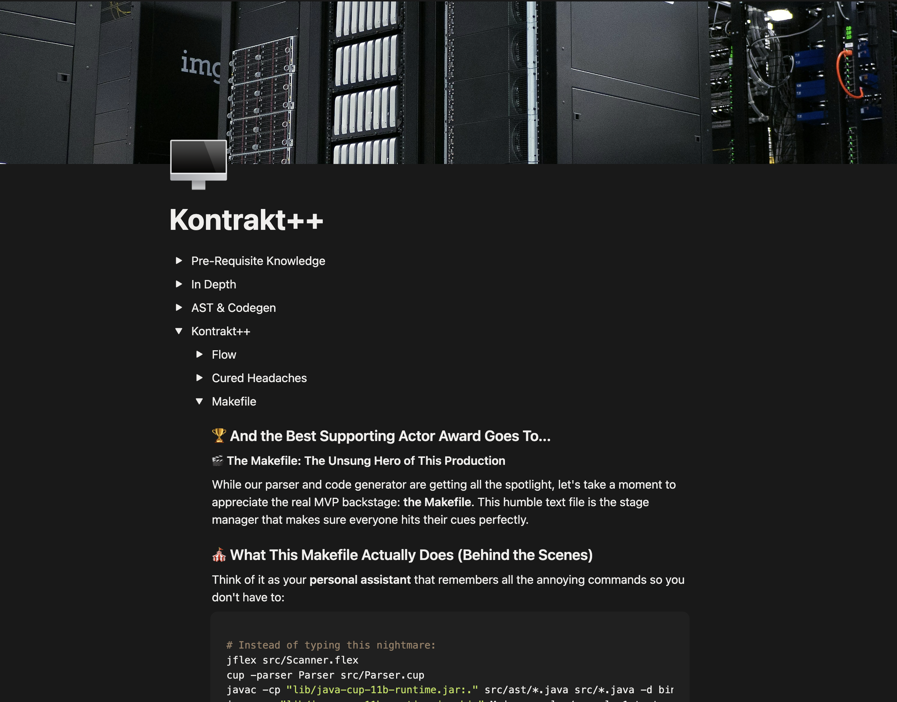

# 🚀 Kontrakt++: Testing APIs shouldn't feel like doing rocket physics

> Kontrakt++ is a DSL that turns your HTTP API tests from Δv = v_e · ln(m0/mf) into actual working Java code, no PhD required 👍🏻

## what sorcery is this?

Kontrakt++ is a **Domain-Specific Language** (a fancy term for "mini-language that does one thing well") that lets you write API tests in a human-friendly format and then magically transforms them into **real JUnit tests** that actually run against your backend.

### The Magic:
.test files (you write) → AST voodoo → GeneratedTests.java (JUnit) → ✅/❌ results


## 📁 Project Structure: Where Things Live
```
Kontrakt/
│
├── backend/          # SpringBoot backend to test against
│
├── bin/              # da "binaries" - export yard
│
├── examples/           # Test files you can actually read
│ ├── assignment.test      # the example input given to us
│ ├── example_1.test       # 6 tests
│ └── example_2.test       # this one is for experimenting
│
├── lib/               # JAR files (the dependencies)
│
├── src/               # The brains of the operation
│ ├── ast/               # Abstract Syntax Tree classes
│ ├── CodeGenerator.java    # I mean, the name 🤷🏻‍♂️
│ ├── Main.java             # The main event
│ ├── Parser.cup            # Grammar rules (CUP)
│ └── Scanner.flex          # Tokenizer rules (JFlex)
│
├── Makefile   # this is one of the coolest things ever (special section at the end)
└── README.md
```


## 🛠️ Setup: getting your ducks in a row

### Step 1: Clone
```bash
git clone https://github.com/notdulain/Kontrakt.git
cd Kontrakt
```

### Step 2: Check Your JARs 🫙
make sure these files exist in lib/ (because even magic needs tools):

```
jflex-full-1.9.1.jar
java-cup-11b.jar
java-cup-11b-runtime.jar
junit-platform-console-standalone-1.10.1.jar
```
if they're missing, well... good luck with compiling 💀

## ⚡ The Fun Part: Making Things Happen (step-by-step)

### Phase 1: Compiling the Parser & Scanner
```bash
make generate
```
what this does: runs JFlex and CUP to create Java code that understands your DSL. Think of it as teaching Java to speak the "test-language".

### Phase 2: Compile everything
```bash
make compile
```
translation: "please turn all this java code into something the computer can actually run (class files)"

### Phase 3: Parse your .test file
```bash
make run
```
What happens: Takes example_1.test (threre are more commands to test others!) and creates GeneratedTests.java. This is where the real magic happens!




## 🎭 Running the backend: The test subject

### Option A: CLI (for terminal nerds)
```bash
cd backend
mvn clean package
java -jar target/testlang-demo-0.0.1-SNAPSHOT.jar
```

### Option B: IntelliJ (jetbrains didn't develop the best IDE for java only for us to use the terminal 🤌🏻)
- open the backend folder as a project in IntelliJ
- build the maven project (troubleshooting this is a whole other paradigm of programming imo)
- find `src/main/java/whatever/KontraktBackendApplication.java`
- look for the cute little green play button ▶️ at the top
- um, click it
- wait for "Started Application" in the console



just to verify, open http://localhost:8080 in your browser. if you see something other than an error, you're golden!

## 🧪 The Grand Finale: Running Tests

### Step 1: Compile the GeneratedTests.java
```bash
make compile-tests
```
this compiles GeneratedTests.java with JUnit in the classpath.

### Step 2: Run the Tests
```bash
make run-tests
```
the moment of truth: this runs your generated JUnit tests against the running backend.



## 🏃🏻 in a hurry?

### 1. start clean and run this:
```bash
make all
```
will compile everything you need to compile

### 2. finally this
```bash
make test-full
```
will parse your .test file, compile the GeneratedTests.java, and even run it against your backend using JUnit Jupiter
(this whole make-thing is pretty cool huh? stay tuned for the _Makefile_ segment 👽)

## 🎪 Example Test Cases That Actually Work (inside example_1.test)
Here's what you can test right now (assuming backend is running):

### 🎯 Test 1: Login
```testlang
test Login {
  POST "/api/login" {
    body = "{ \"username\": \"$username\", \"password\": \"$password\" }";
  }
  expect status = 200;
  expect header "Content-Type" contains "json";
  expect body contains "\"success\": true";
  expect body contains "\"token\":";
  expect body contains "\"message\": \"Login successful\"";
}
```

### 🎯 Test 2: Get User Info
```testlang
test GetUser {
  GET "/api/users/$user_id";
  expect status = 200;
  expect header "Content-Type" contains "json";
  expect body contains "\"id\": 42";
  expect body contains "\"username\": \"user42\"";
  expect body contains "\"email\": \"user42@example.com\"";
  expect body contains "\"role\": \"USER\"";
}
```

### 🎯 Test 3: Update User
```testlang
test UpdateUser {
  PUT "/api/users/$user_id" {
    body = "{ \"role\": \"ADMIN\" }";
  }
  expect status = 200;
  expect header "Content-Type" contains "json";
  expect body contains "\"id\": 42";
  expect body contains "\"updated\": true";
  expect body contains "\"role\": \"ADMIN\"";
  expect body contains "\"message\": \"User updated successfully\"";
}
```

### 🎯 Test 4: Delete User
```testlang
test DeleteUser {
  DELETE "/api/users/$delete_id";
  expect status = 200;
  expect header "Content-Type" contains "json";
  expect body contains "\"id\": 99";
  expect body contains "\"deleted\": true";
  expect body contains "\"message\": \"User deleted successfully\"";
}
```

### 🎯 Test 5: Get Non-Existent User (Error case - only works for 9999)
```testlang
test GetNonExistentUser {
  GET "/api/users/9999";
  expect status = 404;
  expect body contains "\"error\"";
  expect body contains "\"User not found\"";
}
```

### 🎯 Test 6: Login with Invalid Credentials
```testlang
test LoginInvalidCredentials {
  POST "/api/login" {
    body = "{ \"username\": \"wrong\", \"password\": \"wrong\" }";
  }
  expect status = 401;
  expect body contains "\"success\": false";
  expect body contains "\"message\": \"Invalid credentials\"";
}
```

## 📝 to run other .test files:

### assigment.test
```bash
make test-assignment
```
### example_2.test
```bash
make test-example-2
```

## 🏆 And the Best Supporting Actor Award Goes To...
### 🎬 The Makefile: The Unsung Hero of This Production
While our parser and code generator are getting all the spotlight, let's take a moment to appreciate the real MVP backstage: the **Makefile**. This humble text file is the stage manager that makes sure everyone hits their cues perfectly.

### 🎪 What This Makefile Actually Does (Behind the Scenes)
Think of it as your personal assistant that remembers all the annoying commands so you don't have to:
```bash
# Instead of typing this nightmare:
jflex src/Scanner.flex
cup -parser Parser src/Parser.cup
javac -cp "lib/java-cup-11b-runtime.jar:." src/ast/*.java src/*.java -d bin/
java -cp "lib/java-cup-11b-runtime.jar:bin" Main examples/example_1.test
javac -cp "lib/junit-platform-console-standalone-1.10.1.jar:." GeneratedTests.java
java -jar lib/junit-platform-console-standalone-1.10.1.jar --class-path . --scan-class-path

# You just type:
make test-full
```
mic. drop. 🎤

### 📜 The Makefile: A 45-Year-Old Time Traveler
#### 🕰️ 1977: The Birth of a Legend
Picture this: Bell Labs, 1977. A programmer named **Stuart Feldman** is staring at a massive C program that takes **hours to compile**. Constantly fixing one file but having to recompile everything because dependencies are a mess.

One day, after waiting 3 hours for a full rebuild...\
*read the full article (click)* 👇🏻 \
[](https://bit.ly/kontrakt-note)


## 🚨 common "oh cRap" moments & fixes
❌ "Parser error on line X"
Probably: you forgot a semicolon. yes, again 🤦🏻‍♂️ (or forgot your own language's syntax)

❌ "Connection refused to localhost:8080"
Solution: Your backend isn't running. See the "Running the Backend" section above.

❌ "GeneratedTests.java doesn't reflect my changes"
Fix: Run make run again. The generator isn't psychic (yet).

❌ "Tests fail but curl works"
Likely cause: Your test expectations don't match what the backend actually returns. Check those JSON strings!

## 🎊 You Did It!
If you see green checkmarks and passing tests, congratulations! You've successfully:

🏗️ Built a language parser from scratch

🔄 Transformed DSL into executable Java code

🚀 Tested a real HTTP API

😎 Looked cool doing it

now go forth and test all the APIs! or take a well-deserved coffee break, I won't judge 🙂‍↔️
